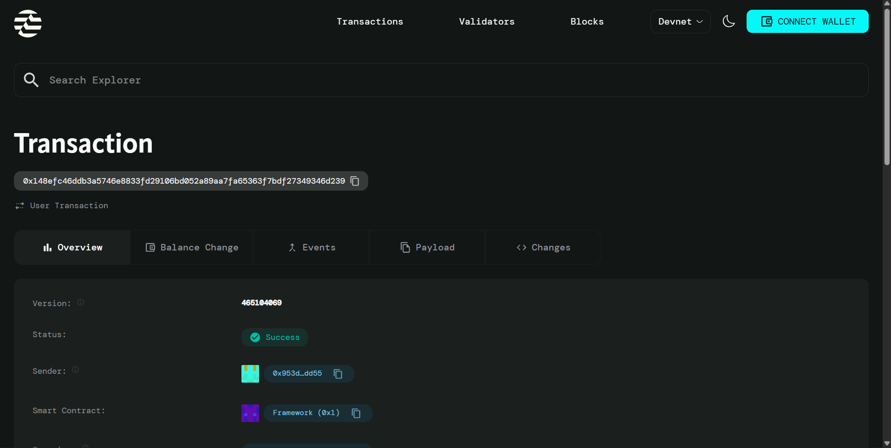

# Play-to-Earn Strategy Game

## Project Description

A turn-based blockchain strategy game built on the Aptos network that combines NFT hero ownership with resource management mechanics. Players can own unique hero NFTs, engage in strategic turn-based battles, and earn cryptocurrency rewards based on their performance. The game creates a sustainable play-to-earn economy where skill and strategy directly translate into tangible rewards.

## contract detail
transection ID:0x148efc46ddb3a5746e8833fd29106bd052a89aa7fa65363f7bdf27349346d239

## Project Vision

Our vision is to revolutionize blockchain gaming by creating an engaging strategy game that proves play-to-earn models can be both fun and economically sustainable. We aim to build a thriving ecosystem where players truly own their in-game assets as NFTs and can earn real value through skillful gameplay. By combining strategic depth with blockchain technology, we're creating a game that appeals to both traditional gamers and crypto enthusiasts.

## Key Features

- **NFT Hero System**: Each player owns a unique hero NFT with distinct characteristics and abilities that can be traded on secondary markets
- **Turn-Based Combat**: Strategic gameplay that rewards tactical thinking and planning over reflexes
- **Resource Management**: Collect and manage in-game resources that can be used for upgrades, purchases, and gameplay advantages
- **Play-to-Earn Rewards**: Earn cryptocurrency tokens by winning battles and completing challenges
- **Battle Progression**: Track your wins and climb leaderboards to become a legendary hero
- **Transparent Smart Contracts**: All game logic runs on-chain with verifiable fairness and security
- **Player Ownership**: True ownership of all in-game assets through blockchain technology

## Future Scope

- **Hero Breeding System**: Allow players to breed and create new unique hero NFTs with combined traits
- **Guild Features**: Form alliances with other players for cooperative gameplay and guild battles
- **Tournament Mode**: Competitive tournaments with large prize pools and exclusive rewards
- **Hero Marketplace**: Dedicated marketplace for trading heroes and in-game items
- **Advanced Resource Economics**: Multiple resource types with crafting and trading systems
- **Mobile App**: Cross-platform support for gaming on the go
- **PvP Arena**: Real-time player versus player battle system
- **Staking Mechanism**: Stake tokens to earn passive rewards and governance rights
- **Land Ownership**: Introduce territory control and base-building mechanics
- **Cross-Chain Bridge**: Enable asset transfers between multiple blockchain networks

## Contract Details

*Contract deployment details and addresses will be added here*